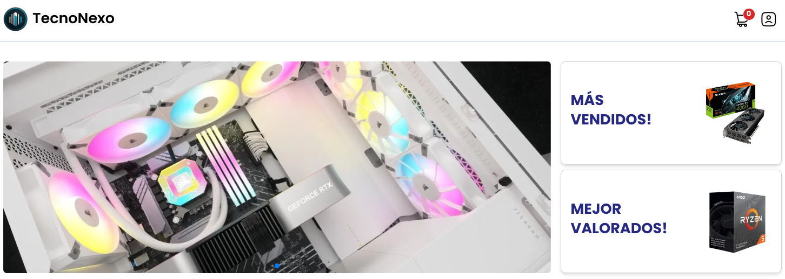

## ¡Bienvenido a TecnoNexo! :wave:



---
#### 🎨 | Funcionalidades
1. **Catálogo de Productos** 📦
   - Mostrar productos con imagen, nombre, descripción y precio.

2. **Carrito de Compras** 🛒
   - Agregar, eliminar y actualizar productos en el carrito.

3. **Checkout** 🛍️
   - Proceso de compra con formulario para información de envío y pago.

4. **Gestión de Órdenes** 📝
   - Confirmación de órdenes y historial de compras.

5. **Autenticación y Registro** 🔐
   - Registro de usuarios y inicio de sesión.

6. **Diseño Responsivo** 🌐
   - Experiencia optimizada en diferentes dispositivos.

7. **Métodos de Pago** 💳
   - Integración de opciones de pago seguras.

8. **Gestión de Inventarios** 📊
   - Actualización automática de stock de productos.

---

#### 🛠️ | Tecnologias usadas

<p align="center">
  <a href="https://reactjs.org">
    
  </a><a href="https://nestjs.com">
    
  </a><a href="https://www.typescriptlang.org">
    
  </a><a href="https://developer.mozilla.org/en-US/docs/Web/JavaScript">
    
  </a><a href="https://tailwindcss.com">
    
  </a><a href="https://developer.mozilla.org/en-US/docs/Web/Guide/HTML/HTML5">
    
  </a><a href="https://www.w3.org/Style/CSS/Overview.en.html">
    </a>
</p>

---

#### :rocket: | Instalación
  ##### Requisitos Previos

Antes de proceder con la instalación, asegúrate de tener los siguientes requisitos previos configurados en tu sistema:

1. **Node.js y npm:** Asegúrate de tener Node.js instalado en tu máquina. Puedes descargarlo desde [nodejs.org](https://nodejs.org/) e incluye npm, el gestor de paquetes de Node.js.

2. **Git:** Necesitarás tener Git instalado para clonar el repositorio del proyecto. Puedes descargar Git desde [git-scm.com](https://git-scm.com/).

Una vez que tengas estos requisitos previos instalados y configurados correctamente, puedes proceder con la instalación del proyecto.

#### Instalación del Frontend

Para instalar y ejecutar el frontend de este proyecto, sigue los siguientes pasos:

1. **Clonar el repositorio:** Utiliza el siguiente comando para clonar el repositorio desde GitHub a tu máquina local:
  ```bash
  git clone https://github.com/OussamaAtifii/project-daw
  ```

2.  **Acceder al directorio del frontend:** Navega al directorio específico del frontend dentro del repositorio clonado:
```bash
cd project-daw/frontend
```
3.  **Ejecutar el servidor de desarrollo:** Una vez dentro del directorio del frontend, ejecuta el siguiente comando para iniciar el servidor de desarrollo:
```bash
npm run dev
```

#### Instalación del Backend

Para instalar y ejecutar el backend de este proyecto, sigue los siguientes pasos:

1. **Clonar el repositorio:** Utiliza el siguiente comando para clonar el repositorio desde GitHub a tu máquina local:
  ```bash
  git clone https://github.com/OussamaAtifii/project-daw
  ```

2.  **Acceder al directorio del frontend:** Navega al directorio específico del backend dentro del repositorio clonado:
```bash
cd project-daw/backend
```

3.  **Ejecutar el servidor de desarrollo:** Una vez dentro del directorio del backend, ejecuta el siguiente comando para iniciar el servidor de desarrollo:
```bash
npm run start:dev
```
--- 
#### :bust_in_silhouette: |  Autor

**Oussama Atifi**
[](www.linkedin.com/in/oussama-atifi) [](https://github.com/OussamaAtifii)


